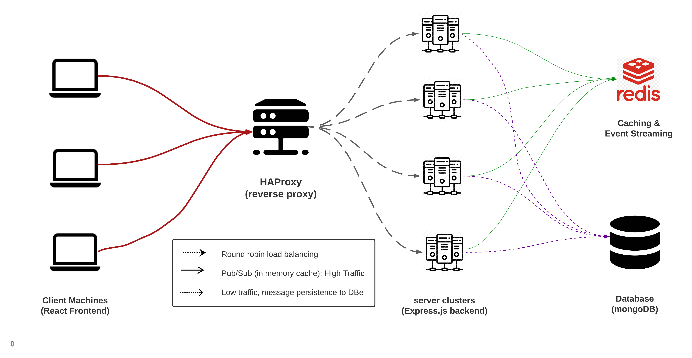

# DS_Project

**Team Id :** 51

|  Team Members |  Programme |   Roll No|
|---------------|------------|----------|
|  Sk Abukhoyer |  M.Tech | 2021201023  |
|  Sourav Kumar Singh | M.Tech   | 2021201072  |
|  Akilesh Panicker | M.Tech  | 2021201081  |
| Debjani Mallick | Ph.D | 2022801019 |

## Multiclient Distributed Real-Time Room-Based Chat Application

This is a chat application that supports unicast, multicast, and broadcast messages. The backend is distributed and horizontally scalable, using Socket.io, Redis (cache and pub/sub to maintain consistency among different servers), HAProxy (for load balancing), and MongoDB (for persistence).

## Setup


### Running backend
As the architecture depends on some components such as redis, mongodb, and haproxy, a docker-compose.yml file is provided in the backend directory. This will pull the respective containers, build the local backend application, and run them by opening the respective ports.
```shell

# go to backend 
$ cd backend

# build the chatapp image
$ docker build -t chatapp .

# run the services
$ docker-compose up # pass -d for detached mode

# to stop the services
$ docker-compose down

```

### Running frontend
The main App.js file contains all the business logic for websocket establishment and respective API calls. First, run the backend services and then proceed to start the frontend server.
```shell
# for dev server run
$ cd react
$ cd chat_app
$ npm start


```

## Architecture


